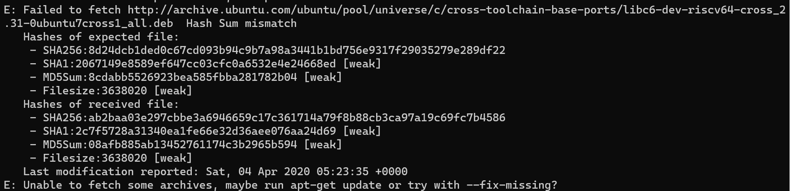
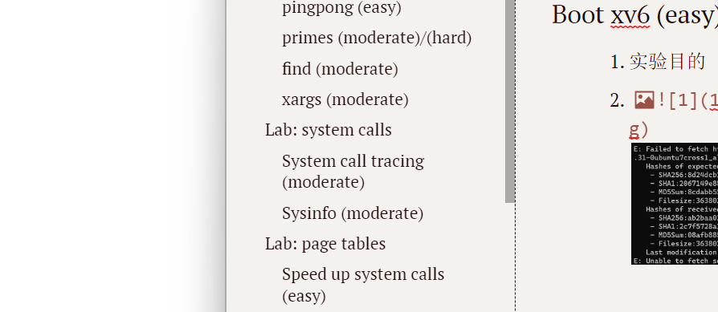

# 2023-OS-Project

# REPORT

## Installing

## Lab: Xv6 and Unix utilities

### Boot xv6 (easy)

1. 实验目的
1. 

3. 

### sleep (easy)

### pingpong (easy)

### primes (moderate)/(hard)

### find (moderate)

### xargs (moderate)

## Lab: system calls

### System call tracing (moderate)

### Sysinfo (moderate)

## Lab: page tables

### Speed up system calls (easy)

### Print a page table (easy)

### Detecting which pages have been accessed (hard)

## Lab: traps

### RISC-V assembly (easy)

### Backtrace (moderate)

### Alarm (hard)

## Lab: Copy-on-Write Fork for xv6

### Implement copy-on write(hard)

## Lab: Multithreading

### Uthread: switching between threads (moderate)

### Using threads (moderate)

### Barrier(moderate)

## Lab: networking

## Lab: locks

### Memory allocator (moderate)

### Buffer cache (hard)

## Lab: file system

### Large files (moderate)

### Symbolic links (moderate)

## Lab: mmap (hard)