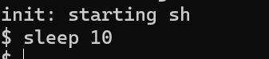

# 2023-OS-Project

# REPORT

## Installing

## Lab: Xv6 and Unix utilities

### Boot xv6 (easy)

1. 实验目的：

   获取源代码并构建、运行、启动xv6。

2. 实验步骤：
   1. 获取实验室的 xv6 源代码并查看 `util` 分支。运行`$ git clone git://g.csail.mit.edu/xv6-labs-2021`获取代码到本地，并`$ cd xv6-labs-2021`、`$ git checkout util`来查看util分支。
   2. 构建并运行xv6。运行`$ make qemu`。后输入ls运行一个初始文件系统的程序，来查看是否成功构建了xv6。
   3. 退出qemu，可用`Ctrl-a x`。
   
3. 实验中遇到的问题与解决方法：暂无
4. 实验心得：学会了如何启动运行xv6系统，往后的操作都在cd进xv6-labs-2021目录后进行

### sleep (easy)

1. 实验目的：编写程序实现程序“睡眠”，使系统暂停一段时间刻度，这段时间刻度由用户给出。如输入sleep 10指令，系统暂停10个时间刻度。如果用户忘记传递参数，睡眠应打印错误消息。

2. 实验步骤：

  1. 编写程序。用程序的sleep来实现停顿。程序名为sleep.c

  2. 将sleep.c保存在user文件夹中，并添加sleep到Makefile中的UPROGS下面。（添加一句$U/_sleep\）

  3. 放入后make qemu编译，输入sleep 10，系统暂停了一段时间。

  4. 测试程序。在主系统运行make grade，输入`./grade-lab-util sleep`，运行结果：

     

     说明程序运行正确。

3. 实验中遇到的问题与解决方法：

   1. 编写好程序、放入user后仍无法运行，原因是没有make qemu重新编译源代码并生成执行文件，重新编译即可正确运行sleep程序

   2. 测试运行时无法运行指令，需要运行sudo chmod +x ./grade-lab-util，来赋予grade-lab-util可执行权限。

4. 实验心得：

   1. 头文件：

      1. `#include "kernel/types.h"`: 包含 types.h 头文件，其中定义了一些 xv6 内核中使用的基本数据类型，如 uint、uchar、ushort 等。

      2. `#include "kernel/stat.h"`: 包含 stat.h 头文件，其中定义了用于文件和文件系统的状态信息结构 stat，以及一些与文件操作相关的常量和函数原型。

      3. `#include "user/user.h"`：包含 user.h 头文件，其中定义了一些用户空间程序常用的函数原型，如 fork()、exec()、exit() 等。

   2. `int main(int argc, char* argv[])`：main函数接受两个参数，整数argc表示命令行参数数量，字符指针数组 argv表示命令行参数列表。为了防止调用错误要检查参数数量是否合规（此处为2）。

   3. 输出错误时用到了`fprintf(2, "Usage: sleep times\n")`，2是一个文件描述符，代表标准错误流（stderr），后面是需要输出的错误信息。

   4. `exit(0)`用于退出程序，而不是写return 0。

      

### pingpong (easy)

1. 实验目的：模拟管道的用法。编写程序来“pingpong” 一对管道上的两个进程之间的字节，父进程向子进程发送一个字节; 子进程打印“<pid>：received ping”，<pid> 是其进程 ID， 将管道上的字节写给父进程、退出; 父进程应从子进程读取字节， 打印“<pid>：received pong”、并退出。
2. 实验步骤：
   1. 编写程序。
   2. 用pipe()来创建管道
   3. fork()来创建子进程。
   4. 用read(src,dst,lenth)来读，write(dst,src,lenth)来写。getpid来获取进程id。再将内容打印出来。
   5. 编译。运行结果：
   6. 运行测试程序：
3. 实验中遇到的问题与解决方法：暂无
4. 实验心得：
   1. 学会了如何使用管道，以及它是如何在进程间通信、传递信息的。如这里是第一个位置读，第二个位置写。在程序编写时要注意程序读写的前后顺序，且操作完要关闭相应读、写端，以免出现错误。
   2. 对于创建进程的`fork()`语句，系统调用它会创建一个新的进程，新进程是父进程的副本。新进程和原始进程共享相同的代码、数据和打开的文件。在父进程中，fork会返回进程uid，子进程中会返回0，所以在分支语句里会分别执行两个分支。

### primes (moderate)/(hard)

1. 实验目的：使用pipe编写一个素数筛，受限于xv6，范围为2~35。第一个进程将数字2到35输入到管道中，对于每个素数创建一个进程，该进程通过一个管道从其左邻居读取，并通过另一个管道向其右邻居写入。当第一个进程达到35时，进入等待。打印完所有输出、所有其他素数进程退出之后，主进程退出。

2. 实验步骤：

   1. 阅读Doug McIlroy的`Bell Labs and CSP Threads`文章，理解素数筛的思想

   2. 编写程序。考虑递归的思想，先创建主进程，在主进程中关闭读端，把2~35传进管道，然后关闭管道的写端，并等待子进程的结束。

   3. 对于子进程，编写了create_number_process函数来实现递归，调用它来创建更多的子进程。在每个子进程中，首先从管道中读取一个质数，然后创建一个新的管道。父进程将质数写入新的管道，然后子进程继续从原始管道中读取数字，并将不是质数的数字写入新的管道（还能读到内容，说明一遍还没有处理完成，还需继续写入新管道）。这样，使子进程负责处理不同的质数。

   4. 编译。运行结果：

   5. 运行测试程序：

      

3. 实验中遇到的问题与解决方法：

   1. 在编写时，有时读写端没有正确关闭，会影响进程间的通信，如：在父进程中写入数据到管道后，如果不关闭写端，子进程无法判断是否已经读取完毕，导致读取阻塞或读取到错误的数据，从而运行报错。为了解决这个问题要在必要的时候正确关闭，如：在各个父进程输入所有数字前关闭读端，输入后关闭写端。
   2. 各个在处理完成后要使用wait(0)进入等待状态，否则会导致子进程没有处理完就退出了，使输出的质数序列不完整。

4. 实验心得：

   对管道的使用有了更深入的体会，了解了进程同时执行的特征，如在不同进程中打印内容来查看执行情况，可能会出现同时交替输出，体现并发性。

### find (moderate)

1. 实验目的：编写一个简单版本的 UNIX 查找程序，来查找指定目录及其子目录中具有特定名称的所有文件。使用递归允许 find 深入到子目录。

2. 实验步骤：

   1. 查看user中ls.c文件，来学习读取目录、访问文件的基本方法。ls用于列出指定目录下的文件和文件夹的信息。读出的目录存放在buf变量中，读出的目录项的信息存在struct dirent类型的变量de中，如要获取目录项名称就可以使用de.name。函数还根据文件类型的不同，进行不同的处理：如果是文件类型（T_FILE），则直接输出文件名、类型、节点号和大小；如果是目录类型（T_DIR），则遍历目录中的文件和文件夹，并输出它们的信息。

   2. 编写程序。检查参数，需要输入目录、文件名两个参数。

   3. 编写了用于递归调用的find函数，传入路径和文件名。当访问到目录时，要检查是否是当前目录'.'或者上级目录'..'，如果是则跳过。如果不是就遍历目录，对其中的文件de.name取其名称，并与传入的name比较，如果一样就输出路径。如果当前目录还含有子目录，就递归调用find传入当前路径，在子目录中继续寻找。

   4. 编译。运行结果：      

   5. 运行测试程序：

      

3. 实验中遇到的问题与解决方法：

   1. 在使用de.name获取目录项名称、来检查目录是否为'.'或者'..'时出现错误，无法使用strcmp比较得到一致的结果，从而导致递归错误。经过排查后发现是获取的名称可能含有空格，遂在程序中编写了remove_space来去除空格，返回纯文件名，再进行比较。
   2. 如果不过滤上级目录、当前目录，可能导致无限递归等情况，所以要检查当前目录的情况。

4. 实验心得：

   了解了xv6访问目录、读取文件信息的一般方法，以及可能访问出错的一些情况，如文件打开失败、文件状态获取失败、文件路径太长等情况，对于这些情况要一一给出报错提示。

### xargs (moderate)

1. 实验目的：编写一个简单版本的 UNIX xargs 程序，从管道获取标准输入的读取行内容（出现'\n'前算一行），将这些行作为参数提供给其他命令。

2. 实验步骤：
   1. 理解如何在一个程序中调用其他命令（使用`exec(argv[0], argv);`）
   2. 编写程序。逐行读取内容，读到换行符时将内容存储到新字符串组中，传递给子进程来执行。
   3. 编译。运行结果：
   4. 运行测试程序：

3. 实验中遇到的问题与解决方法：
   1. 一开始将执行指令直接写在了父进程中，从标准输入读取完字符直接用`exec(child_argv[0], child_argv);`语句执行了指令，导致报错。原因是在父进程中执行指令会使父进程被阻塞，直到指令执行完成，过程中无法继续读取下一行命令，从而无法实现并发执行多个命令的效果，也会使命令读取参数时出现错误。解决方法是在fork()创建子进程，在父程序中wait等待子进程执行结束。

4. 实验心得：

   了解了xargs指令是如何将参数读取并传递给其他指令的，并对指令的并发执行有了更进一步的理解。

## Lab:system calls

###System call tracing (moderate)

1. 实验目的：为系统编写、添加一个系统调用跟踪功能，创建一个trace系统调用。它采用一个参数，一个整数“掩码”，其位指定要跟踪哪些系统调用。如：要跟踪 fork 系统调用，程序调用`trace(1 << SYS_fork)`，其中`SYS_fork`是来自`kernel/syscall.h`的系统调用号。如果掩码中设置了系统调用的编号，则修改 xv6 内核，以便在每个系统调用即将返回时打印一行，该行应包含进程 ID、系统调用名称和返回值。

2. 实验步骤：

   1. 将`$U/_trace`添加到 Makefile 中的 UPROGS，并编写trace.c放入user文件夹下，以便编译调用。该程序检测参数，在参数正确时调用系统的trace函数，实现跟踪。

   2. 在`user/user.h`中添加系统调用的原型。在其system calls下添加：`int trace(int);`

   3. 在`user /usys.pl`中添加调用原型。在其中添加：`entry("trace");`

   4. 在`kernel/syscall.h`中添加系统调用号。添加：`#define SYS_trace  22`

   5. 在`kernel/sysproc.c`中添加`sys_trace()`函数，该函数通过记住`proc`结构中新变量中的掩码参数(mask)来实现跟踪的系统调用。函数如下图所示：

      

   6. 在`kernel/proc.h`的proc结构体中加入上述变量mask。添加：`int mask;`

   7. 在`kernel/proc.c`中修改fork()函数，使跟踪掩码能从父进程复制到子进程。添加：`np->mask = p->mask;`

   8. 在`kernel/syscall.c`中加入相应的trace项，并在其中添加一个存储系统调用名的数组，以用于打印输出。然后修改其中的syscall函数，使函数检查当前进程的掩码（mask）是否设置了对应系统调用的trace。如果设置了，函数就会打印出该系统调用的名称、进程ID和返回值。

      

      

   9. 编译。测试语句`trace 32 grep hello README`，`trace 2147483647 grep hello README` 和`grep hello README`的运行结果如下图所示：

   10. 运行测试语句`trace 2 usertests forkforkfork`，跟踪usertests中forkforkfork测试的所有后代的 fork 系统调用。结果：

3. 实验中遇到的问题与解决方法：

   1. 一开始编写时将打印进程信息等过程写在user/trace.c中，导致代码较为冗长且输出和运行都发生错误。后将这些操作放在syscall.c中，这样也有利于在后续需要用到系统调用trace时，能够正确打印信息。
   2. 在内核中添加系统调用时需要修改多个文件，为所添加的系统调用提供所需入口，缺失则会导致运行报错。当make qemu报错时根据提示查找是在user中的错误还是在kernel中的错误，并逐一修正。

4. 实验心得：

   学会如何为系统添加新的系统调用，理解了系统函数在用户态(user)和内核态(kernel)的联系。

###Sysinfo(moderate)

1. 实验目的：实现一个系统调用sysinfo，收集有关正在运行的系统的信息。

   该系统调用采用一个参数：指向struct sysinfo 的指针 。参阅`kernel/sysinfo.h`，如下图所示：

   

   内核也补充完整此结构体的字段：`freemem`字段应设置为可用内存的字节数，`nproc` 字段应设置为状态 不是UNUSED的进程数

   系统已提供测试程序 `sysinfotest`，如果能够打出"sysinfotest: OK"则说明通过测试。

2. 实验步骤：

   1. 依据与system call-tracing实验相同的步骤，在内核中加入sysinfo的系统调用。

   2. 在`kernel/sysproc.c`中添加`sys_sysinfo(void)`函数，用于将系统的信息复制到用户空间中，使用的是copyout()方法。函数如下图所示：

      

   3. 在`kernel/kalloc.c`中添加用于获取空闲可用内存量的`getfreememSize()`函数。函数如下图所示：

      

   4. 在`kernel/proc.c`中添加用于收集进程数的`proc_getnum()`函数。

      

   5. 运行测试程序sysinfotest.c，运行结果：

      

3. 实验中遇到的问题与解决方法：

   1. 在获取空闲内存、获取进程数时，开始忽略了获取锁、释放锁而使函数独立访问内存的操作，测试程序仍能正常打印出ok而不会报错。然而在实际运行中的多线程、多进程环境中，忽略这样的操作可能会导致数据一致性问题、产生不可预测的结果。如多个线程或进程同时对内存链表进行操作时，可能导致节点的丢失、重复计数或其他不一致的情况，且如果其他进程此时改变了链表，也会导致程序对无效的内存进行操作，从而产生报错。为了防止后续使用这一系统调用时产生这一问题，后续添加了获取、释放锁的操作。使用`acquire(&kmem.lock)`获取锁，`release(&kmem.lock)`释放锁。

4. 实验心得：

   学习了kalloc.c中的内存数据结构、proc.c中的进程结构，通过它们的成员来获取信息。巩固了系统添加新的系统调用的步骤。

   

##Lab: page tables
###Speed up system calls (easy)
###Print a page table (easy)
### Detecting which pages have been accessed (hard)

## Lab: traps

### RISC-V assembly (easy)

### Backtrace (moderate)

### Alarm (hard)

## Lab: Copy-on-Write Fork for xv6

### Implement copy-on write(hard)

## Lab: Multithreading

### Uthread: switching between threads (moderate)

### Using threads (moderate)

### Barrier(moderate)

## Lab: networking

## Lab: locks

### Memory allocator (moderate)

### Buffer cache (hard)

## Lab: file system

### Large files (moderate)

### Symbolic links (moderate)

## Lab: mmap (hard)